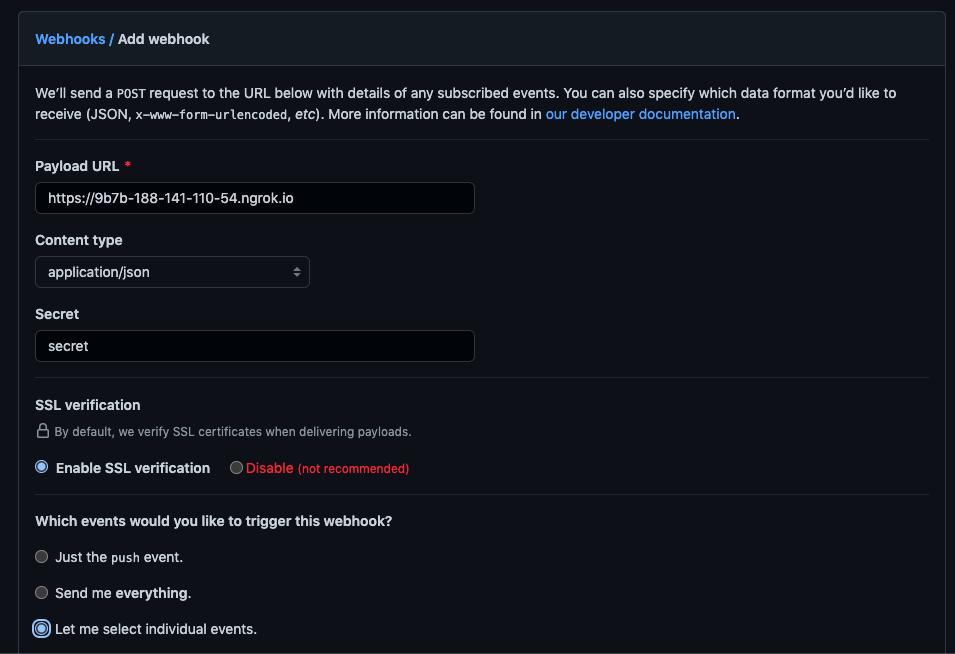
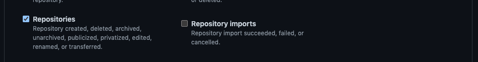

# AwsomeWebhook

Webhook to set up protection rules of repositories Github Organizations.

##  :mega: Requirements

 1. Docker
 2. Ngrok
 3. Personal Github Access Token
 4. GitHub Organization account 
 
 ## :books: Resources
 5. [Docker installation](https://www.docker.com/products/docker-desktop)
 6. [Ngrok installation](https://ngrok.com/download)
 7. [GitHub Account Creation](https://github.com/join)
 8. [Create an Access Token](https://github.com/settings/tokens/new)
	  Permisson for the token are
	  - [x] repo: Full control of private repositories
	  - [x] admin:org Full control of orgs and teams, read and write org projects
## :computer: How to run the app

1. Run Ngrok to get a public URLs linked to your computer
```bash
ngrok http 5000
# Output should look like this
ngrok by @inconshreveable                                                                                                                                                                   (Ctrl+C to quit)

Session Status                online
Account                       yosephbuitrago.01@gmail.com (Plan: Free)
Version                       2.3.40
Region                        United States (us)
Web Interface                 http://127.0.0.1:4040
Forwarding                    http://9b7b-188-141-110-54.ngrok.io -> http://localhost:5000
Forwarding                    https://9b7b-188-141-110-54.ngrok.io -> http://localhost:5000

Connections                   ttl     opn     rt1     rt5     p50     p90
                              0       0       0.00    0.00    0.00    0.00
```
2. Export the secrets and github token as environment variable in a different terminal
```bash
# Linux
export GITHUB_TOKEN=ghp_XXXXXXXXX
export WEBHOOK_SECRET=XXXXXXX
```
3. Build the application with docker
```bash
docker build --target production -t awsomewebhook:lastet .
# Or use the Makefile recipe
make build
```
4. Run the app
```bash 
docker run -d --rm --name awsomewebhook -p 5000:5000 awsomewebhook:lastet
# Or use the Makefile recipe
make run
```
5. Check app running on port 5000
```bash
docker ps
CONTAINER ID   IMAGE                  COMMAND           CREATED          STATUS          PORTS                                       NAMES
52a81b99ad3b   awsomewebhook:lastet   "python app.py"   24 seconds ago   Up 19 seconds   0.0.0.0:5000->5000/tcp, :::5000->5000/tcp   awsomewebhook
```
6.  Configre the webhook in the Github Organization
 - [x] URL from ngrok command
 - [x] Content type: application/json
 - [x] Secret: XXXXXXX
 - [x] Enable SSL verification
 - [x] Let me select individual events:  Repositories




 
